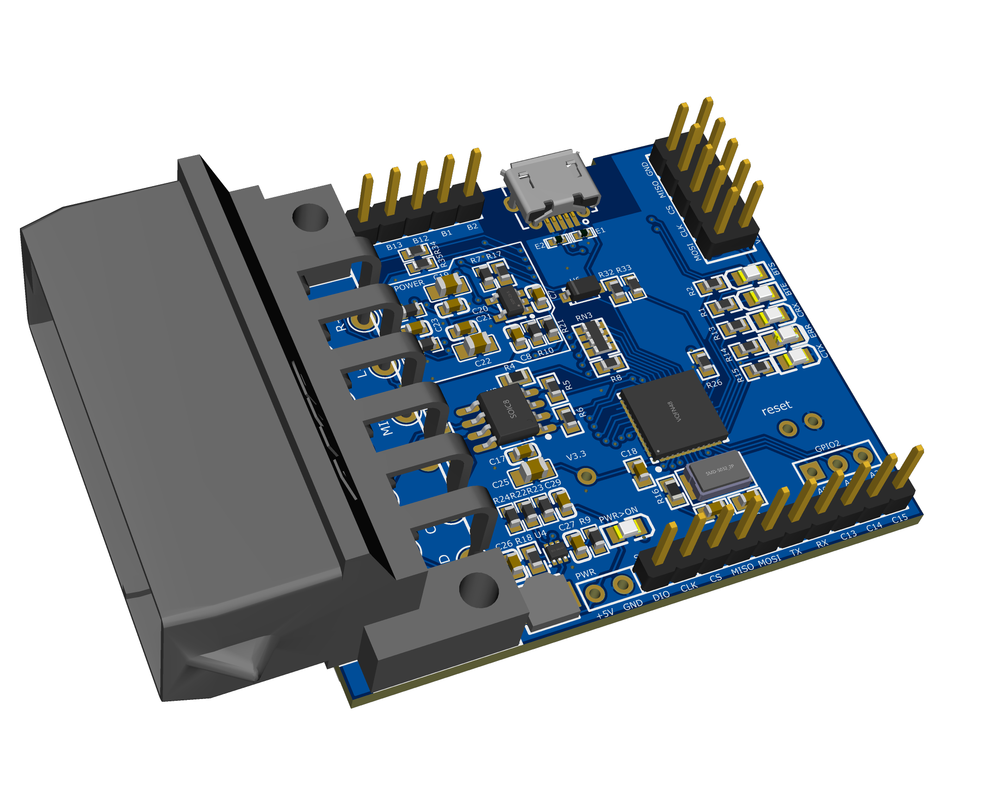

# SAAB compact disk changer emulator

An easy way to add new multimedia functionality to your old car, based on the STM32 microcontroller and bluetooth receiver module CSR8645, RRD-305, QCC3005, which communicates via the CAN BUS protocol and completely simulates the presence and functionality of the original device.

## Features

Support AVCTP control from steerling wheel buttons and IHU buttons;

Reducing the volume level on revese gear shaft position;

## Installation

Can be installed in the original place in the trunk of the car;

## Documentation

- [PSB project](https://oshwlab.com/germka/cdcemu_stm32)
- [3D modeling](https://www.tinkercad.com/things/ilOajaed17D-saabcdcemuv20?sharecode=B5w6PaUzLr1GzISFAL70bzKVDpNO_U5eLHJtqSOlsjQ)

## Compiling

Project maked in STM32CubeIDE and including only user files, but system code (HAL and RTOS) can be regenerated in CubeIDE and compiled in another IDE or manualy with toolchain arm-none-eabi-gcc;

## Flashing

For programming MCU used ST-LINK and STM32CubeProgrammer;

Bluetooth reciever need to bee reconfigured to use input control levels instead impulse, CCID and another settings, you can make it with FT232 USB module [:howto:](https://bois083.wordpress.com/2016/10/08/playing-audio-files-with-csr8645-bluetooth-chip/) or with [CSR programmer](https://aliexpress.ru/item/4001285433196.html)

## TODO

- Power save mode (sleep)
